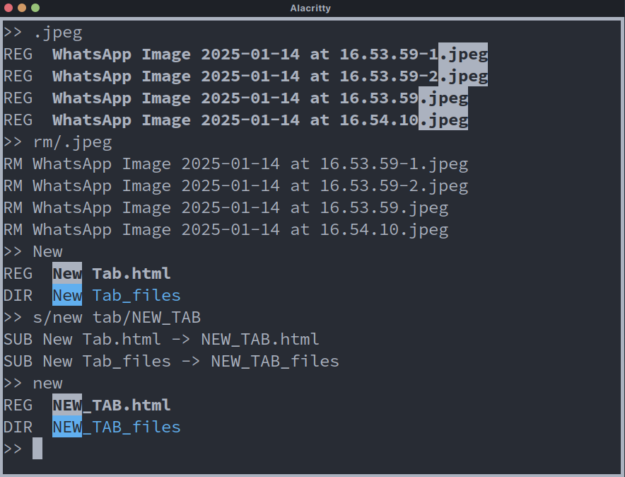

## Directory View

### About
Visual directory management tool.



### Disclaimer
I am not responsible for any damage, loss, or unintended
consequences caused to your files, whether due to your
actions or a program malfunction. Use at your own risk.

### Installation

Clone the repository and compile the source code:
```sh
git clone https://github.com/hugocotoflorez/dv
make
```

Optionally, you can install it globally:
```sh
make install
```

>[!CAUTION]
> Make sure `~/.local/bin/` is included in your `PATH`
environment variable.

### Documentation (Quick Reference)

It uses [posix regex (BRE)](https://en.wikibooks.org/wiki/Regular_Expressions/POSIX_Basic_Regular_Expressions).
You can change to Extended Regular Expression by
modifying the source code.

#### SRCH
`PATTERN`
Highlights files or directories matching the specified
pattern.

#### SUB
`S/PATTERN/TEXT`
Replaces occurrences of the `pattern` with the provided
text in the names of matching files or directories.

#### INS
`I/PATTERN/TEXT`
Inserts the specified text at the beginning of the names
of files or directories that match the pattern.

#### APN
`A/PATTERN/TEXT`
Appends the specified text to the end of the names of files
or directories that match the pattern.

#### CD
`CD/PATTERN`
Changes the current directory to the first match of the
pattern.

#### RM
`RM/PATTERN`
Deletes all files or directories matching the pattern.

#### PROT
`PROT/PATTERN/MODE`
Changes the permissions of files matching the pattern to the
specified mode (octal value as in `chmod`).

#### CLEAR
`CLEAR` clear the screen.

#### ENTER
`<CR>` Show all entries in current directory.

>[!NOTE]
> All upercase commands can be written in lowercase
